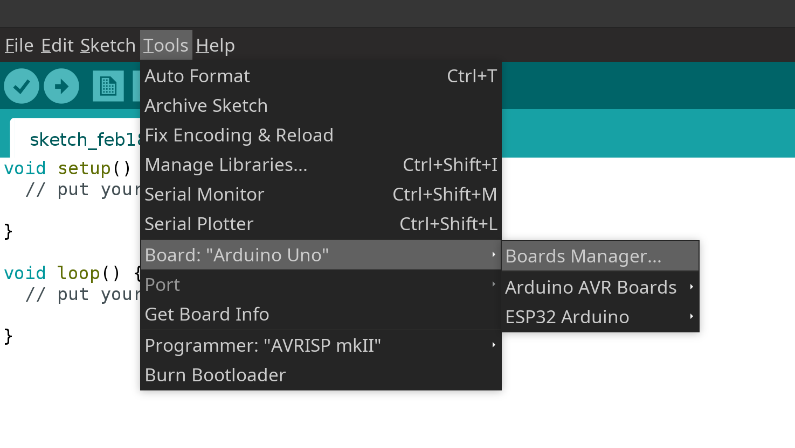
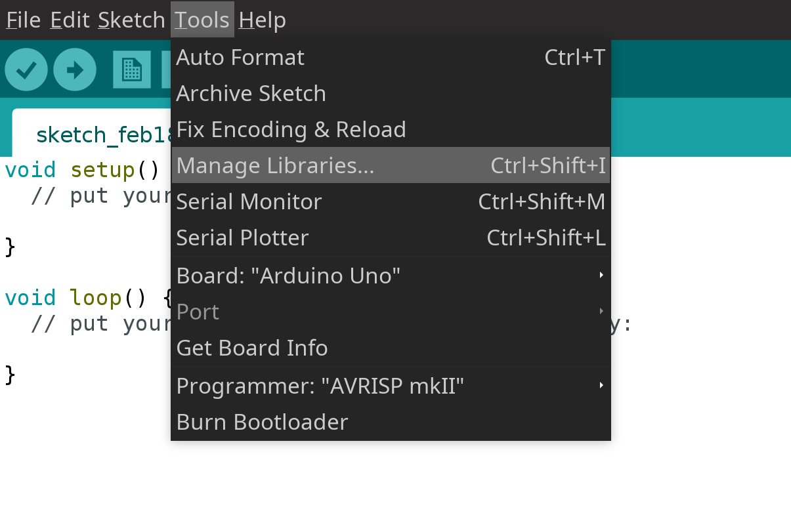

# Smart Irrigation System IoT UniTN


<!-- TABLE OF CONTENTS -->
<details>
  <summary>Table of Contents</summary>
  <ol>
    <li><a href="#about-the-project">About The Project</a></li>
    <li><a href="#project-layout">Project Layout</a></li>
    <li>
      <a href="#basic">Basic</a>
      <ul>
        <li><a href="#basic-requirements">Requirements</a></li>
      </ul>
    </li>
    <li>
      <a href="#iot-integration">IoT Integration</a>
      <ul>
        <li><a href="#iot-requirements">Requirements</a></li>
        <ul>
            <li><a href="#hardware">Hardware</a></li>
            <li><a href="#software">Software</a></li>
        </ul>
        <li><a href="#project-wiring">Project Wiring</a></li>
        <li><a href="#get-started">Get Started</a></li>
            <ol>
                <li><a href="#set-nodejs-server-ip-adress-in-esp32-code">Set NodeJS server IP adress in ESP32 code</a></li>
                <li><a href="#create-env-file">Create .env file</a></li>
                <li><a href="#load-program-image-on-esp32">Load program image on ESP32</a></li>
                <li><a href="#start-the-all-project">Start the all project</a></li>
                <li><a href="#telegram-bot-interface">Telegram bot interface</a></li>
            </ol>
      </ul>
    </li>
  </ol>
</details>


## About the project
Intro text

### Project Layout
```
SmartIrrigation_IoTUniTN
├── ccsProject  (temporaneo)
│   ├── dataCompression             # credo tutto da togliere
│   ├── file to add to workspace    # cambiare nome cartella
│   └── mainProjectFolder 
├── ESP32code
│   ├── ESP32code.ino               # ESP32 main
│   ├── httpClient                  # personal functions
│   ├── httpServer                  # |
|   └── readUARTdata                # └
├── node_server
│   ├── app.js                      # main nodejs app
│   ├── sensorsDataAPI.js           # functions to manage data in DB
│   ├── servers.js                  # declaring nodejs http server and telegram bot
│   ├── startServer.js              # start telegram bot, http server and connect to database
│   ├── supportFunction.js          # personal function
│   └── usersAPI.js                 # functions to manage users data in DB
├── readmeImages
│   └── images                      # images for readme
└── README.md
```

## Basic


### Basic Requirements

# IoT integration

This extension allows you to connect the basic system to the internet. In this way you can visualize all your data from your Telegram account with different mode, like in realtime or ondemand. You will also be able to start and stop manually the water pump.

This bot can respond to different Telegram account and the people that starts it will be included in a gruop. The group created will be always update with a message when the pump changes its state, for whatever reason (by manual command, by telegram command or automatically).

## IoT Requirements

### Hardware

You will only need an ESP32 (ESP-WROOM-32) and some other jumpers wire.

### Software

1. NodeJS 
2. npm
3. Arduino IDE (version 1.8.19 is recommended)
4. Telegram app and at least one account
5. Telegram bot
6. MongoDB, MongoDBCompass

#### **NodeJS, npm**
How can I install all of this? Just follow next instructions.
To install `NodeJS` and `npm` you can easily follow the instruction on this [guide]( https://docs.npmjs.com/downloading-and-installing-node-js-and-npm).

Now that `NodeJS` and `npm` are installed, opne the `node_server` folder in your terminal and type this command

```
npm install
```
This command will install for you all the NodeJS packages needed.

#### **Arduino IDE**
Simply download the version for you on their [official web site](https://www.arduino.cc/en/software) and follow the installation procedure.

Once you installed it you have to download some libraries to be able to operate on the ESP32 and manage http comounication between NodeJS server and ESP32.

First of all open Arduino IDE and go to `tool > Board > Boards Manager`, search for ESP32 by Espressif Systems and press install.





Then we want to install the libraries required for the http comunication.

Go to `tool > Manage Libraries` and search for:

1. HttpClient by Adrian McEwen
2. WebServer_ESP32_SC_ENC by Khoi Hoang
3. WiFiManager by tablatronix




Nice, now your Arduino enviroment is ready.

#### **Telegram app, account**

You can download `Telegram` app directly from your store and create a new account if you haven't already.

#### **Telegram bot**

For this extension you have to create your own bot for obvious reason but don't worry, it will be easy!

To create your own bot open [BotFather]( https://t.me/BotFather) and press start button below.


Then you will see some of the operation that the BotFather can do for you so digit or press 
```
/newbot
```
Now you only have to follow its instruction. Remember to save saftily the token thet it will give you, you will need it later!
The last thing you should do in the BotFather is to set commands. Simply digit 
```
/setcommands
```
and then copy and paste this list of commands
```
commands - for all commands
get_last_moisture - for the last soil moisture value recived
get_last_brightness - for the last enviromental brightness value recived
get_last_temperature - for the last temperature value recived
get_last_data - for last data recived
get_last_n_data - for the last n data (if possible). NOTE: write your number after command
get_realtime_data - to enter in realtime mode and see real time data
stop_realtime - to exit realtime mode
start_pump - to manually star the pump
stop_pump - to manually stop the pump
```

Now the configuration of the bot is done too!

#### **MongoDB, MongoDBCompass**

Now you have two solution:
1. running the database on your local machine
2. running the database on the cloud

You can careate your local cluster with `MongoDB` and `MongoDBCompass` following this [guide](https://zellwk.com/blog/local-mongodb/) (how to create the database and how to connect it, don't look at how to connect from server NodeJS). This method is good if you have a home server but it is not the best if you haven't because your machine should run 24/7.

Otherwhise you can create your MongoDB account and create your cluster online. Follow this [guide](https://www.mongodb.com/basics/clusters/mongodb-cluster-setup) for that.

Onece you have your cluster you have to create one database, witch will be composed of two collection:
1. Users
2. Sensors_data

It is very important to name these collection exactly in this way.

At the end you should have something like this in your Database.


Now the configuration of the software is done, later we will have to modify some code!

## Project wiring

## Get started

Now we have to modify some code to make it work for you.

### Set NodeJS server IP adress in ESP32 code

We need to tell the ESP32 which address to send the data to so, in the `ESP32code` folder open `httpClient.cpp` in a text editor and change the 6th line. Insert the local IP address of the pc where the server will be running.

```c++
// node server address
String serverNode = "http://<yourServerIP>:3000";
```
Now ESP32 code is ready!

### Create .env file

Now you have to create a file named `.env` in the `node_server` folder. <br>
Once you created it, open it and in the first 2 line write:
```javascript
TELEGRAM_TOKEN = '<yourTelegramBotToken>'
DB_URL = '<yourMongoDBconnectioinLink>/<yourDatabaseName>'
```

In the first you need to copy and paste the token given to you by the BotFather and in the second you have to copy and paste the connetion link of your database, followed by the name of your cluster.<br>
If your database is localy hosted the string will look something like 
```
mongodb://localhost:27017
```
otherwise it will look something like
```
mongodb+srv://<username>:<password>@<clusterName>.[randomCharacter].mongodb.net
```

### Load program image on ESP32

It is time to load the ESP32 code on the board.

In the `ESP32code` folder open `ESP32code.ino` with Arduino IDE, connect the ESP32 to the computer with a USB cable and then press the little arrow icon on the top left of the screen to load the code in the board. It will take some time.


*NOTE: when a sequence of dots appears in the bottom of the Arduino IDE, make sure to press the boot button on the ESP32 until the dots stop.*

You should end with something like that


### Start the all project

First of all power the ESP32 via USB or input pin.

In this first phase we want to tell to ESP32 what network it should connect to. <br>
The board will act like an access point, so go to your wifi settings (via pc or smartphone) and connect to `AutoConnectAP`: a web page like below should open automatically, if not open your browser and search for WiFiManager in the top bar


After connecting to local WiFi with ESP32, you can power the MSP432 as well and replicate the project wiring.

Lastly we have to start our NodeJS server. Just open the `node_server` folder in a terminal and digit
```
node app.js
```
In this terminal you will see lots of log information that can be usefull, in some cases.

At this point the project should be perfectly running!

### Telegram bot interface 

If you want to be able to use your Telegram bot just open your app and search for the bot that you have created, start it and enjoy!
You can ask for the last soil moisture, enviromental brightness and temperature registered in the database, you can see data in realtime activating realtimie mode (it will send you data every 10 seconds), you can ask for the last N data saved on the database and finally you can manually start and stop the pump!

Here an example of the telegram interface.


